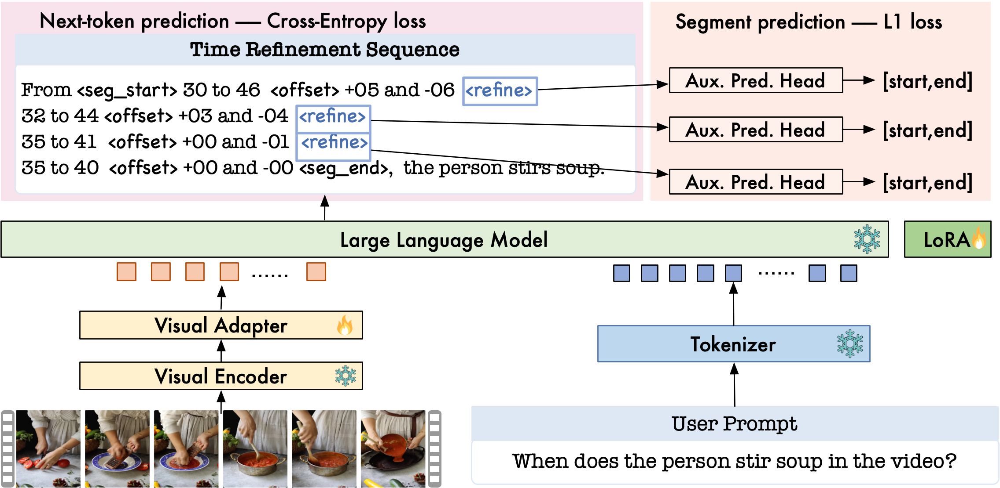

# TimeRefine 
Official PyTorch implementation of the paper "TIMEREFINE: Temporal Grounding with TimeRefining Video LLM".

---

## TimeRefine Overview 

---

## Data Preparation

We follow the same data preparation pipeline as VTimeLLM. Please check out [VTimeLLM training](https://github.com/huangb23/VTimeLLM/blob/main/docs/train.md) for instructions on downloading pretrained models and datasets. Please download the stage2 and stage3 training files and the best checkpoint [here](https://drive.google.com/drive/folders/1QTa0QZO7hAhBIbPPuedY_S1NycYH7rz0?usp=sharing). 

## Installation

For installation, please check out [install_env.md](docs/install_env.md).

## Training

For training, check out [train_scripts.md](docs/train_scripts.md).

## Evaluation

For evaluation, check out [eval_scripts.md](docs/eval_scripts.md).

## Acknowledgements 

We sincerely appreciate the incredible projects that contributed to the development of TimeRefine:

* [LLaVA](https://github.com/haotian-liu/LLaVA): Large Language and Vision Assistant
* [FastChat](https://github.com/lm-sys/FastChat): An Open Platform for Training, Serving, and Evaluating Large Language Model based Chatbots
* [Video-ChatGPT](https://github.com/mbzuai-oryx/Video-ChatGPT): Towards Detailed Video Understanding via Large Vision and Language Models
* [LLaMA](https://github.com/facebookresearch/llama): Open and Efficient Foundation Language Models
* [Vid2seq](https://github.com/google-research/scenic/tree/main/scenic/projects/vid2seq): Large-Scale Pretraining of a Visual Language Model for Dense Video Captioning
* [InternVid](https://github.com/OpenGVLab/InternVideo/tree/main/Data/InternVid): A Large-scale Video-Text dataset
* [VTimeLLM](https://github.com/huangb23/VTimeLLM): Empower LLM to Grasp Video Moments 
* [VTG-LLM](https://github.com/gyxxyg/VTG-LLM): Integrating Timestamp Knowledge into Video LLMs for Enhanced Video Temporal Grounding 

